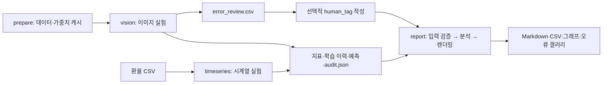

# Predictive Model Diagnostics Pipeline

## 프로젝트 소개

Few-shot 이미지 분류와 일별 환율 예측에서 **어떤 모델이 더 잘 작동하고, 어디서 실패하는지** 비교하는 PyTorch 실험 프로젝트다. 전이학습 전략과 시계열 베이스라인을 같은 평가 구간에서 비교하고, 학습 곡선·오분류 사례·실측 지표로 결과를 해석한다.

저장된 결과부터 보려면 [진단 리포트](reports/reference/diagnosis.md)와 [베이스라인 비교](reports/reference/baseline_comparison.md)를 확인한다. 새 실험은 아래 설치·실행 절차로 재현할 수 있다.

## 핵심 특징

| 트랙 | 기본 데이터·설정 | 비교 대상 | 평가 |
| --- | --- | --- | --- |
| 이미지 분류 | CIFAR-10 cat/deer/dog, 클래스당 Train 40장 | Scratch, Linear Probing, Fine-tuning, 증강 + 정규화 | Cross entropy, 정확도, 오분류 사례 |
| 시계열 예측 | 2020~2024 원/달러 환율 1,249건, 입력 30개 관측 | Naive, SMA(5/10/20), EMA(0.1/0.3/0.5), RNN, LSTM, 잔차 LSTM | MAE, RMSE, MAPE |

- 시계열은 시간순 7/1/2로 분할하고 Train 통계로만 정규화한다.
- checkpoint와 베이스라인 선택에는 Validation을 사용하고, Test에서 최종 성능을 비교한다.
- CSV·실험 기록에서 Markdown 리포트와 그래프를 생성한다. 성능이 나빠진 비교도 음수 개선률로 표시한다.
- 자동 오류 태그는 가설로 취급하고, 사람이 작성하는 `human_tag`와 구분한다.

## 아키텍처



일반 기능은 flat 모듈로 두고, 분석·표현·템플릿이 함께 쓰이는 리포트만 패키지로 묶었다.

```text
src/diagnostics/
├── cli.py               명령 진입점
├── constants.py         모듈 간 공유 설정
├── io.py                파일·표 직렬화
├── plotting.py          공통 학습 곡선
├── reproducibility.py   seed·결정적 실행 설정
├── prepare.py           데이터·가중치 준비
├── timeseries/
│   ├── __init__.py      기존 공개 함수·설정 import 경로
│   ├── data.py          시계열 검증·분할·정규화·윈도우
│   ├── evaluation.py    인과적 베이스라인·회귀 지표
│   ├── training.py      순환 모델·학습
│   └── pipeline.py      실험 실행·파일 저장
├── vision/
│   ├── __init__.py      기존 공개 함수·설정 import 경로
│   ├── data.py          표본 분할·중복 검사·이미지 변환
│   ├── training.py      ResNet 구성·학습·평가
│   ├── artifacts.py     검수용 오류 이미지·CSV 저장
│   └── pipeline.py      실험 실행·파일 저장
├── review.py            검수 집계·오류 갤러리
└── report/
    ├── __init__.py      공개 진입점 run()
    ├── inputs.py        입력 로딩·검증
    ├── analysis.py      모델 선택·성능 비교·진단 계산
    ├── render.py        Markdown·그래프 표현
    ├── pipeline.py      실행 순서·파일 저장
    └── templates/      Markdown 본문
```

리포트 문구는 `templates/`, 계산 방식은 `analysis.py`, 입력 계약은 `inputs.py`에서 수정한다. 전처리·분할·학습 조건은 [실험 정책](docs/protocol.md)에 정리했다.

## 저장된 실험 결과

`reports/reference/`는 기존 실행의 기록이다. 기존 실측 데이터를 사용해 현재 코드로 리포트를 재생성한 결과이며, 모델을 다시 학습한 결과는 아니다.

| 이미지 전략 | Test 정확도 |
| --- | ---: |
| Scratch | 42.13% |
| Linear Probing | 76.80% |
| Fine-tuning | 75.33% |
| 증강 + 정규화 | 71.47% |

| 시계열 모델 | Test MAE (KRW/USD) |
| --- | ---: |
| Naive | 5.0737 |
| RNN | 7.9137 |
| LSTM | 8.0968 |
| 잔차 LSTM | 5.0918 |

출처: [이미지 지표 CSV](reports/reference/vision/metrics.csv), [시계열 지표 CSV](reports/reference/timeseries/metrics.csv). 이 실행에서는 전이학습이 Scratch보다 좋았지만, 증강은 기본 Fine-tuning보다 나빴다. 잔차 LSTM은 기본 LSTM보다 개선됐으나 Naive를 넘지는 못했다.

## 설치

Python 3.10 이상이 필요하며 현재 실험 코드는 CPU에서 실행된다. 아래는 Linux/macOS 셸 기준이다. 저장소를 내려받은 뒤 **프로젝트 루트에서** 실행한다.

```bash
python3 -m venv .venv
source .venv/bin/activate
python -m pip install torch torchvision --index-url https://download.pytorch.org/whl/cpu
python -m pip install -e '.[test]'
diagnostics --help
```

설치에는 네트워크가 필요하다. 이미지·가중치는 `prepare`에서 내려받으며 이후 실험은 로컬 캐시를 사용한다. 환율 CSV는 저장소에 포함돼 있어 시계열 실험만 할 때는 `prepare`가 필요 없다.

기존 Linux/Python 3.12 CPU 환경의 패키지 버전은 [requirements.lock.txt](requirements.lock.txt)에 기록했다. 해당 버전으로 설치하려면 위 패키지 설치 두 명령 대신 다음을 사용한다. 다른 플랫폼에서의 설치 가능성이나 동일한 수치 결과를 보장하지는 않는다.

```bash
python -m pip install -r requirements.lock.txt --extra-index-url https://download.pytorch.org/whl/cpu
python -m pip install -e . --no-deps
```

## 새 실험 실행

```bash
# CIFAR-10·사전학습 가중치 다운로드 및 동봉 환율 CSV 복사
diagnostics prepare --data data

# 각 --output은 아직 존재하지 않는 경로여야 한다
diagnostics timeseries --output reports/my-run/timeseries --epochs 50
diagnostics vision --data data --output reports/my-run/vision --epochs 10

# 두 트랙이 완료되면 종합 리포트 생성
diagnostics report --run reports/my-run
```

결과는 `reports/my-run/diagnosis.md`부터 확인한다. `timeseries`와 `vision`은 기존 출력 디렉터리가 있으면 중단한다. 재실행할 때는 새 경로를 지정한다. `report`와 `review`는 지정한 실행의 파생 문서·통계·그림을 갱신하므로, 보존할 결과는 먼저 복사한다.

`report`는 두 트랙의 `audit.json`과 관련 CSV를 요구한다. 입력·템플릿을 확인한 뒤 리포트와 오류 갤러리를 생성하며 모델을 재학습하지 않는다. 저장된 결과로 생성 과정만 확인하려면 다음처럼 복사본을 사용한다.

```bash
# reports/reference-copy가 없는 상태에서 실행
cp -R reports/reference reports/reference-copy
diagnostics report --run reports/reference-copy
```

### 별도 시계열 CSV

```bash
diagnostics timeseries --csv /path/to/series.csv --output reports/custom-run/timeseries
```

필수 열은 `date,value`다. `ticker`가 있으면 단일 값이어야 한다. 날짜 중복·결측, 비유한값·0 이하 값을 거부하며, 최소 700개 관측과 1,095일의 기간, 날짜 간격 중앙값 1일을 검사한다. 보간이나 결측 제거는 이 명령에서 자동으로 수행하지 않는다.

### 사람 검수

생성된 `vision/error_gallery.html`을 로컬 브라우저로 열고, `vision/error_review.csv`의 `human_tag`에 관찰한 오류 원인을 기록한다. 허용 태그는 [실험 정책](docs/protocol.md)을 따른다.

```bash
diagnostics review --csv reports/my-run/vision/error_review.csv
diagnostics report --run reports/my-run
```

빈 태그는 미검수로 처리하고, 중복 ID나 허용되지 않은 태그는 오류로 처리한다. 현재 CLI는 검수 건수가 0이어도 완료할 수 있다. 자동 `suggested_tag`는 사람이 확인한 실패 원인을 대신하지 않는다.

## 산출물과 데이터

| 경로 | 내용 |
| --- | --- |
| `datasets/` | 동봉 환율 CSV와 수집 이력·SHA-256 |
| `data/` | 다운로드 캐시와 준비된 데이터. Git 제외 |
| `reports/<run>/timeseries/` | 지표·예측·학습 이력·분할 기록·그래프 |
| `reports/<run>/vision/` | 지표·Test 예측·학습 이력·분할 기록·오류 분석표·갤러리·원본 이미지 |
| `reports/<run>/diagnosis.md` | 종합 진단 리포트 |
| `reports/<run>/baseline_comparison.md` | 베이스라인별 성능과 개선률 |
| `reports/<run>/vision/review_status.json` | 사람 검수 건수와 실패 원인별 통계 |

기본 출력은 리포트·필수 시각화와 재생성/검증에 필요한 원자료만 저장한다. 손실 진단·개선률·클래스별 혼동 통계는 Markdown에 포함하고 별도 CSV로 중복 저장하지 않는다. Train/Validation 개별 예측은 저장하지 않으며 해당 성능은 `metrics.csv`에 남긴다. 오류 원본은 `vision/errors/`에 개별 PNG로 저장하며 HTML 갤러리에서 확인할 수 있다.

학습 checkpoint(`.pt`)는 기본적으로 저장하지 않는다. 가중치가 필요하면 `vision` 또는 `timeseries` 명령에 `--save-checkpoints`를 추가한다. Git에는 포함하지 않는다. 데이터·모델 출처는 [sources.md](docs/sources.md), 환율 수집 기록은 [provenance.json](datasets/provenance.json)을 확인한다.

## 개발 및 검증

```bash
python -m pytest -q
python -m ruff check src tests
python -m ruff format --check src tests
```

`tests/unit/`은 시계열 누수 방지·분할·모델 동결·리포트 계산 등을, `tests/integration/`은 CLI·검수·리포트 산출물과 입력 오류 시 기존 결과 보존을 확인한다. 테스트는 동봉 결과와 작은 입력을 사용하며 외부 데이터 다운로드나 전체 실험 재학습을 요구하지 않는다.

## 해석 범위

- 저장된 수치는 단일 seed·제한된 학습 예산의 결과다. 통계적 유의성이나 최적 모델을 입증하지 않는다.
- 시계열은 과거 실측을 사용하는 rolling one-step 평가다. 전체 Test 기간을 한 번에 예측하는 장기 예측이 아니다.
- 사전학습 모델은 외부 ImageNet 데이터와 학습 비용의 이점을 포함한다.
- 자동 손실 진단은 휴리스틱이다. 원인 판단에는 학습 곡선·데이터 특성·실제 오류 관찰이 필요하다.
- 개선률의 기준 오차가 0이거나 지표가 없으면 CSV는 빈 값, 비교 리포트는 `N/A`로 표시한다.
