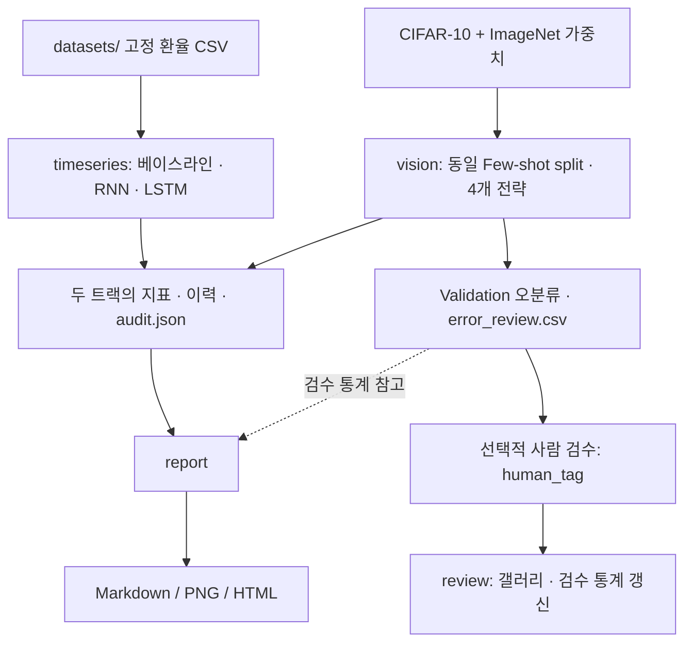

# Predictive Model Diagnostics Pipeline

## 프로젝트 소개

Few-shot 이미지 분류와 일별 환율 예측에서 모델의 실패를 진단하는 PyTorch 실험 프로젝트다. 실제 데이터로 무작위 초기화·전이학습 전략 및 시계열 베이스라인·RNN·LSTM을 비교하고, 학습 곡선과 오분류 사례로 개선의 효과와 한계를 기록한다.

## 핵심 특징

- CIFAR-10 cat/deer/dog, 클래스당 Train 40장: Scratch / Linear Probing / 전체 Fine-tuning / 증강 + 정규화 비교
- 2020~2024 일별 원/달러 환율 1,249건: Naive, SMA(5/10/20), EMA(0.1/0.3/0.5), RNN, LSTM, 잔차 LSTM 비교
- Train/Validation/Test 시간순 7/1/2, Train 전용 scaler, 미래 입력·샘플 간 hidden state 혼합 검증
- 실제 측정 CSV 기반 진단 리포트, 개선률, 학습 곡선·예측 그래프·비교 막대그래프·오분류 갤러리
- 자동 제안 태그와 선택적인 사람 검수를 분리하고 검수 건수·태그 분포를 정보성 통계로 제공

## 아키텍처



`src/diagnostics/`에 데이터 준비·이미지·시계열·검수·리포트를 분리했다. 입력 및 출력 계약, 전처리와 실험 조건은 [실험 정책](docs/protocol.md)에 기술했다.

## 실측 결과

[진단 리포트](reports/reference/diagnosis.md), [베이스라인 비교](reports/reference/baseline_comparison.md), [오분류 갤러리](reports/reference/vision/error_gallery.html), [평가 항목 대응](docs/rubric-map.md)을 확인한다. HTML은 로컬 브라우저에서 열면 된다.

오류 갤러리와 `error_review.csv`로 오분류 원인을 선택적으로 검토할 수 있다. `suggested_tag`는 자동 가설이며 `human_tag` 및 실제 사람 검수와 구분된다. 사람 검수 통계는 분석 보조 정보이며 모델 실험 완료 조건이 아니다. 결과를 좋게 보이게 하려고 Test를 재튜닝하거나 예시 수치를 실험 결과로 쓰지 않는다.

## 설치

Python 3.10 이상, CPU 지원. 최초 이미지·가중치 다운로드에는 인터넷이 필요하다. 약 400MB 데이터와 모델 checkpoint 저장 공간을 확보한다.

```bash
python3 -m venv .venv
source .venv/bin/activate
python -m pip install torch torchvision --index-url https://download.pytorch.org/whl/cpu
python -m pip install -e '.[test]'
```

실행한 환경은 Python 3.12 CPU이며 정확한 의존성 버전은 `requirements.lock.txt`에 보존했다. 같은 Linux CPU 환경 재현 시 다음을 사용한다.

```bash
python -m pip install -r requirements.lock.txt --extra-index-url https://download.pytorch.org/whl/cpu
python -m pip install -e . --no-deps
```

## 실행

```bash
# 공개 CIFAR-10과 가중치 캐시 확보, 동봉 환율 스냅샷 검증
diagnostics prepare --data data

# 출력 경로는 새 디렉터리여야 함; reference 결과 덮어쓰기 방지
diagnostics timeseries --output reports/my-run/timeseries --epochs 50
diagnostics vision --data data --output reports/my-run/vision --epochs 10

diagnostics report --run reports/my-run
python -m pytest -q
```

별도 CSV는 `diagnostics timeseries --csv /path/to/data.csv --output reports/new-run/timeseries`로 입력한다. `date,value` 열이 필수이며 `ticker` 열이 있다면 한 종류여야 한다. 3년 이상, 관측 700개 이상, 날짜 중복 없음, 양수·유한값을 요구한다. 시계열 실험은 온라인 API 없이 동봉 데이터만으로 실행 가능하다.

## 사람 검수 (선택)

1. `reports/my-run/vision/error_gallery.html`에서 실제 Validation 오분류 이미지를 확인한다.
2. 같은 경로의 `error_review.csv`에 검토한 사례의 `human_tag`를 작성한다. 허용 태그와 관찰 기준은 [실험 정책](docs/protocol.md)에 있다.
3. 아래 명령으로 검수 상태와 리포트를 갱신한다.

```bash
diagnostics review --csv reports/my-run/vision/error_review.csv
diagnostics report --run reports/my-run
```

검수가 0건이어도 정상 종료한다. 허용된 `human_tag`가 있어야 검수 건수로 집계한다. 중복 `sample_id`나 허용되지 않은 `human_tag` 등 잘못된 데이터는 오류로 처리한다. 두 실험 트랙이 정상 완료되면 검수 건수와 무관하게 리포트를 생성한다. 사람 태그 분포에 따라 다음 증강·정규화 실험을 결정하고 새로운 결과 폴더에 기록한다. 자동 증강 비교는 사전 지정 실험이며 사람의 원인 분석 이후 수행한 실험으로 간주하지 않는다.

## 산출물과 출처

- `reports/reference/`: 실제 실행한 표·그림·로그·분할 manifest. `.pt` checkpoint는 로컬에만 보관한다.
- `datasets/`: 연준 공식 H.10 원/달러 관측값의 고정 CSV 및 출처·수집 경로·SHA-256. 휴일 ND 56건을 제외했다.
- `data/`: CIFAR-10 원본과 ImageNet 가중치 캐시. Git 제외.
- `docs/sources.md`: 공식 데이터 및 모델 문서 출처.
- `docs/private/`: 사용자 제공 원본 과제. 기존 Git 제외 설정을 유지한다.

베이스라인보다 나쁜 결과도 보고한다. 단일 seed·제한된 학습 예산의 결과이며 장기 예측이나 통계적 유의성을 입증하지 않는다.
