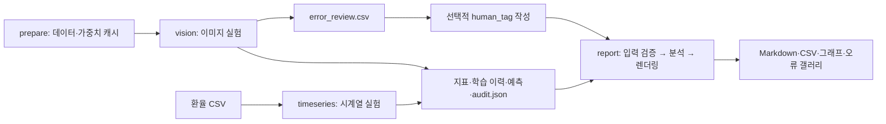

# 예측 모델 진단 파이프라인

## 프로젝트 소개

Few-shot 이미지 분류와 일별 환율 예측에서 **어떤 모델이 더 잘 작동하고, 어디서 실패하는지** 비교하는 PyTorch 실험 프로젝트다. 전이학습 전략과 시계열 베이스라인을 같은 평가 구간에서 비교하고, 학습 곡선·오분류 사례·실측 지표로 결과를 해석한다.

저장된 결과부터 보려면 [이미지 모델 최종 성능](reports/reference/vision/final_performance.png)과 [시계열 모델 최종 성능](reports/reference/timeseries/final_performance.png)을 확인한다. 자세한 결과는 [진단 리포트](reports/reference/diagnosis.md)에 있으며, 베이스라인별 성능과 개선률도 함께 확인할 수 있다. 새 실험은 아래 설치·실행 절차로 재현할 수 있다.

## 핵심 특징

| 트랙 | 기본 데이터·설정 | 비교 대상 | 평가 |
| --- | --- | --- | --- |
| 이미지 분류 | CIFAR-10 cat/deer/dog, 클래스당 Train 40장 | Scratch, Linear Probing, Fine-tuning, 증강 + 정규화 | Cross entropy, 정확도, 오분류 사례 |
| 시계열 예측 | 2020~2024 원/달러 환율 1,249건, 입력 30개 관측 | Naive, SMA(5/10/20), EMA(0.1/0.3/0.5), RNN, LSTM, 잔차 LSTM | MAE, RMSE, MAPE |

- 시계열은 시간순 7/1/2로 분할하고 Train 통계로만 정규화한다.
- checkpoint와 베이스라인 선택에는 Validation을 사용하고, Test에서 최종 성능을 비교한다.
- CSV·실험 기록에서 Markdown 리포트와 그래프를 생성한다. 성능이 나빠진 비교도 음수 개선률로 표시한다.
- 최종 Test 정확도 1위 모델의 Validation 오분류를 모으고, `human_tag`와 `review_note`를 확인·수정할 수 있다.

## 아키텍처

| 경로 | 역할 |
| --- | --- |
| `src/diagnostics/cli.py`, `constants.py` | 명령 조립과 공유 기본값 |
| `src/diagnostics/prepare.py` | 데이터·사전학습 가중치 준비 |
| `src/diagnostics/timeseries/` | 시계열 검증·분할·인과적 기준선·순환 모델·평가 |
| `src/diagnostics/vision/` | 이미지 분할·전이학습·평가·오류 산출물 |
| `src/diagnostics/search/` | 탐색 설정·단일 학습·병렬 실행·불확실성·CLI |
| `src/diagnostics/report/`, `review.py` | 입력 검증·진단 계산·보고서·사람 검수 |
| `tests/unit/`, `tests/integration/` | 데이터 계약·모델·보고서·CLI 회귀 테스트 |
| `datasets/`, `reports/reference/` | 출처가 기록된 환율 입력과 기존 실측 결과 |
| `pyproject.toml`, `uv.lock` | CPU 패키지 출처·고정 의존성·개발 도구 |


```mermaid
flowchart LR
    P["prepare: 데이터·가중치 캐시"] --> V["vision: 이미지 실험"]
    D["환율 CSV"] --> T["timeseries: 시계열 실험"]
    V --> A["지표·학습 이력·예측·audit.json"]
    T --> A
    V --> E["error_review.csv"]
    E --> H["선택적 human_tag 작성"]
    H --> R["report: 입력 검증 → 분석 → 렌더링"]
    A --> R
    R --> O["Markdown·CSV·그래프·오류 갤러리"]
```

실험 트랙은 데이터·학습·평가·저장 책임으로 나누고, 보고서는 입력·분석·렌더링·조립으로 분리합니다. 잔차 LSTM 탐색은 `search/`의 설정·학습 작업·병렬 실행·보고 모듈을 사용합니다. 리포트 문구는 `report/templates/`, 계산 방식은 `report/analysis.py`, 입력 계약은 `report/inputs.py`에서 관리합니다. 전처리·분할·학습 조건은 [실험 정책](docs/protocol.md)에 정리했습니다.

## 저장된 실험 결과

`reports/reference/`는 ResNet18 네 학습 전략의 실측 기록이다. 최고 Test 정확도 모델의 Validation 오류로 분석표와 갤러리를 구성한다.

| 이미지 전략 | Test 정확도 |
| --- | ---: |
| Scratch | 42.13% |
| Linear Probing | 76.80% |
| Fine-tuning | 75.33% |
| 증강 + 정규화 | 71.47% |

| 시계열 모델 | Test MAE (KRW/USD) |
| --- | ---: |
| Naive | 5.0737 |
| RNN | 7.9137 |
| LSTM | 8.0968 |
| 잔차 LSTM | 5.0918 |

출처: [이미지 지표 CSV](reports/reference/vision/metrics.csv), [시계열 지표 CSV](reports/reference/timeseries/metrics.csv). 이 실행에서는 전이학습이 Scratch보다 좋았지만, 증강은 기본 Fine-tuning보다 나빴다. 잔차 LSTM은 기본 LSTM보다 개선됐으나 Naive를 넘지는 못했다.

## 설치

Python 3.12와 uv를 사용합니다. 저장소 루트에서 실행합니다.

```bash
uv sync --frozen
uv run --frozen diagnostics --help
```

`uv.lock`은 기존 CPU 실험 환경의 고정 버전을 유지합니다. `torch`와 `torchvision`만 공식 PyTorch CPU 인덱스에서 설치하고 나머지 패키지는 PyPI에서 설치합니다. 개발 환경도 같은 잠금 파일을 사용하며 별도 `PYTHONPATH`가 필요하지 않습니다.

이미지·가중치는 `prepare`에서 내려받고 이후 실험은 로컬 캐시를 사용합니다. 환율 CSV는 저장소에 포함되어 시계열 실험만 할 때는 `prepare`가 필요 없습니다. 설치 버전이 같아도 플랫폼에 따른 동일 수치 결과까지 보장하지는 않습니다.

## 새 실험 실행

```bash
# CIFAR-10·사전학습 가중치 다운로드 및 동봉 환율 CSV 복사
uv run --frozen diagnostics prepare --data data

# 각 --output은 아직 존재하지 않는 경로여야 한다
uv run --frozen diagnostics timeseries --output reports/my-run/timeseries --epochs 50
uv run --frozen diagnostics vision --data data --output reports/my-run/vision --epochs 10

# 두 트랙이 완료되면 종합 리포트 생성
uv run --frozen diagnostics report --run reports/my-run
```

결과는 `reports/my-run/diagnosis.md`부터 확인한다. `timeseries`와 `vision`은 기존 출력 디렉터리가 있으면 중단한다. 재실행할 때는 새 경로를 지정한다. `report`와 `review`는 지정한 실행의 파생 문서·통계·그림을 갱신하므로, 보존할 결과는 먼저 복사한다.

`report`는 두 트랙의 `audit.json`과 관련 CSV를 요구한다. 입력·템플릿을 확인한 뒤 리포트와 오류 갤러리를 생성하며 모델을 재학습하지 않는다. 저장된 결과로 생성 과정만 확인하려면 다음처럼 복사본을 사용한다.

```bash
# reports/reference-copy가 없는 상태에서 실행
cp -R reports/reference reports/reference-copy
uv run --frozen diagnostics report --run reports/reference-copy
```

### 잔차 LSTM 하이퍼파라미터 탐색

```bash
uv run --frozen diagnostics-search --output reports/residual-search-repeat --workers 4
```

입력 길이·hidden 크기·학습률·weight decay·배치 크기·손실함수의 3,600개 조합을 탐색한다. 상위 24개를 3개 시간 구간 × 3개 seed로 비교하고, Validation으로 고정한 설정 하나를 Test에서 10개 seed로 평가한다. 새 결과는 지정한 출력 경로의 `report.md`, 선택한 값은 `selected.json`에서 확인한다. 실제 Naive 대비 개선이 없으면 그대로 기록한다.

완료한 [탐색 결과](reports/residual-search/report.md)에서는 Validation 9회 중 8회 이긴 설정도 Test에서는 승리 0회·동률 2회·패배 8회였다. 평균 MAE는 Naive 5.07368 대비 5.11044로 약 0.72% 악화됐다. **Naive를 꾸준히 이기는 설정을 확보하지 못했으며, 추가 탐색을 종료하고 기존 기본값을 유지한다.**

출력 경로는 새 디렉터리를 사용한다. Test 평가 전에 중단된 탐색은 같은 명령에 `--resume`을 추가해 이어서 실행할 수 있다. 최대 학습 횟수는 `--epochs`(기본 60), 조합 수는 `--trials`(기본 전체 3,600)로 지정한다. 기존 기준 실험의 Test를 이미 확인했으므로 이번 결과도 완전히 새로운 데이터에서의 검증으로 해석하지 않는다.

### 별도 시계열 CSV

```bash
uv run --frozen diagnostics timeseries --csv /path/to/series.csv --output reports/custom-run/timeseries
```

필수 열은 `date,value`다. `ticker`가 있으면 단일 값이어야 한다. 날짜 중복·결측, 비유한값·0 이하 값을 거부하며, 최소 700개 관측과 1,095일의 기간, 날짜 간격 중앙값 1일을 검사한다. 보간이나 결측 제거는 이 명령에서 자동으로 수행하지 않는다.

### 사람 검수

`vision/errors/`의 원본 이미지를 확인하고, `vision/error_review.csv`의 `human_tag`에 관찰한 오류 원인을 기록한다. `vision/error_gallery.png`에는 대표 사례 최대 30건이 표시된다. 허용 태그는 [실험 정책](docs/protocol.md)을 따른다.

```bash
uv run --frozen diagnostics review --csv reports/my-run/vision/error_review.csv
uv run --frozen diagnostics report --run reports/my-run
```

빈 태그는 미검수로 처리하고, 중복 ID나 허용되지 않은 태그는 오류로 처리한다. 현재 CLI는 검수 건수가 0이어도 완료할 수 있다.

## 산출물과 데이터

| 경로 | 내용 |
| --- | --- |
| `datasets/` | 동봉 환율 CSV와 수집 이력·SHA-256 |
| `data/` | 다운로드 캐시와 준비된 데이터. Git 제외 |
| `reports/<run>/timeseries/` | 지표·예측·학습 이력·분할 기록·그래프 |
| `reports/<run>/vision/` | 지표·Test 예측·학습 이력·분할 기록·오류 분석표·갤러리·원본 이미지 |
| `reports/<run>/diagnosis.md` | 베이스라인별 성능과 개선률을 포함한 종합 진단 리포트 |
| `reports/<run>/vision/review_status.json` | 사람 검수 건수와 실패 원인별 통계 |

기본 출력은 리포트·필수 시각화와 재생성/검증에 필요한 원자료만 저장한다. 손실 진단·개선률·클래스별 혼동 통계는 Markdown에 포함하고 별도 CSV로 중복 저장하지 않는다. Train/Validation 개별 예측은 저장하지 않으며 해당 성능은 `metrics.csv`에 남긴다. 오류 원본은 `vision/errors/`에 개별 PNG로 저장한다.

학습 checkpoint(`.pt`)는 기본적으로 저장하지 않는다. 가중치가 필요하면 `vision` 또는 `timeseries` 명령에 `--save-checkpoints`를 추가한다. Git에는 포함하지 않는다. 데이터·모델 출처는 [실험 정책의 출처 절](docs/protocol.md#데이터모델-출처), 환율 수집 기록은 [provenance.json](datasets/provenance.json)을 확인한다.

## 개발 및 검증

```bash
make check
make test
make smoke
make build
```

`make check`는 문서·문법·Ruff 정적 분석과 포맷을 확인합니다. `make test`는 `uv run --frozen pytest -q`로 전체 단위·통합 테스트를, `make smoke`는 같은 테스트 중 `smoke` 마커가 붙은 짧은 실행 검사를 수행합니다. CI도 같은 잠금 파일과 명령을 사용합니다.

`tests/unit/`은 시계열 누수 방지·분할·모델 동결·리포트 계산을, `tests/integration/`은 CLI·검수·산출물과 실패 시 기존 결과 보존을 확인합니다. 테스트는 임시 경로와 작은 입력을 사용하며 외부 데이터 다운로드나 전체 실험 재학습을 요구하지 않습니다.

## 해석 범위

- 저장된 수치는 단일 seed·제한된 학습 예산의 결과다. 통계적 유의성이나 최적 모델을 입증하지 않는다.
- 시계열은 과거 실측을 사용하는 rolling one-step 평가다. 전체 Test 기간을 한 번에 예측하는 장기 예측이 아니다.
- 사전학습 모델은 외부 ImageNet 데이터와 학습 비용의 이점을 포함한다.
- 자동 손실 진단은 휴리스틱이다. 원인 판단에는 학습 곡선·데이터 특성·실제 오류 관찰이 필요하다.
- 개선률의 기준 오차가 0이거나 지표가 없으면 CSV는 빈 값, 비교 리포트는 `N/A`로 표시한다.
