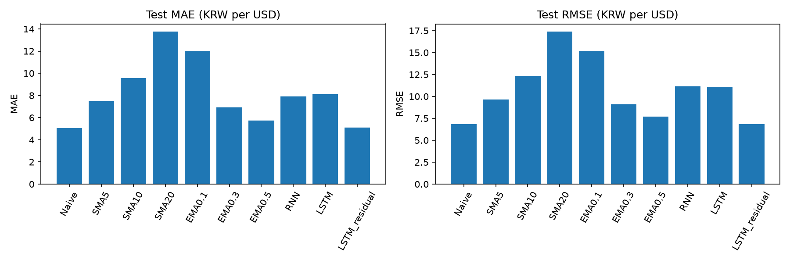

# 베이스라인 비교

동일 Test 날짜, 동일 원 단위로 비교했다. 개선률은 `100 × (베이스라인 오차 − 모델 오차) / 베이스라인 오차`이며, 음수는 악화를 의미한다.

| model | MAE | RMSE | MAPE | MAPE_excluded |
| --- | --- | --- | --- | --- |
| Naive | 5.0737 | 6.8293 | 0.3720 | 0 |
| SMA5 | 7.4883 | 9.6573 | 0.5486 | 0 |
| SMA10 | 9.5579 | 12.3129 | 0.6990 | 0 |
| SMA20 | 13.7652 | 17.3965 | 1.0037 | 0 |
| EMA0.1 | 11.9989 | 15.1703 | 0.8746 | 0 |
| EMA0.3 | 6.9378 | 9.1102 | 0.5078 | 0 |
| EMA0.5 | 5.7385 | 7.6743 | 0.4206 | 0 |
| RNN | 7.9137 | 11.1535 | 0.5726 | 0 |
| LSTM | 8.0968 | 11.1204 | 0.5881 | 0 |
| LSTM_residual | 5.0918 | 6.8393 | 0.3733 | 0 |

## 베이스라인별 개선률 (%)

| model | baseline | MAE | RMSE | MAPE |
| --- | --- | --- | --- | --- |
| RNN | Naive | -55.9749 | -63.3183 | -53.9271 |
| RNN | SMA5 | -5.6808 | -15.4934 | -4.3721 |
| RNN | SMA10 | 17.2026 | 9.4165 | 18.0839 |
| RNN | SMA20 | 42.5096 | 35.8866 | 42.9536 |
| RNN | EMA0.1 | 34.0469 | 26.4780 | 34.5310 |
| RNN | EMA0.3 | -14.0656 | -22.4282 | -12.7669 |
| RNN | EMA0.5 | -37.9043 | -45.3359 | -36.1383 |
| LSTM | Naive | -59.5841 | -62.8335 | -58.0936 |
| LSTM | SMA5 | -8.1262 | -15.1506 | -7.1973 |
| LSTM | SMA10 | 15.2867 | 9.6854 | 15.8666 |
| LSTM | SMA20 | 41.1793 | 36.0769 | 41.4094 |
| LSTM | EMA0.1 | 32.5208 | 26.6962 | 32.7589 |
| LSTM | EMA0.3 | -16.7051 | -22.0647 | -15.8193 |
| LSTM | EMA0.5 | -41.0953 | -44.9045 | -39.8233 |
| LSTM_residual | Naive | -0.3573 | -0.1468 | -0.3416 |
| LSTM_residual | SMA5 | 32.0029 | 29.1794 | 31.9622 |
| LSTM_residual | SMA10 | 46.7265 | 44.4541 | 46.6007 |
| LSTM_residual | SMA20 | 63.0095 | 60.6856 | 62.8127 |
| LSTM_residual | EMA0.1 | 57.5645 | 54.9163 | 57.3223 |
| LSTM_residual | EMA0.3 | 26.6079 | 24.9270 | 26.4898 |
| LSTM_residual | EMA0.5 | 11.2696 | 10.8800 | 11.2545 |

기준 오차가 0이거나 지표가 누락되면 개선률은 정의되지 않으므로 N/A로 표시한다.

