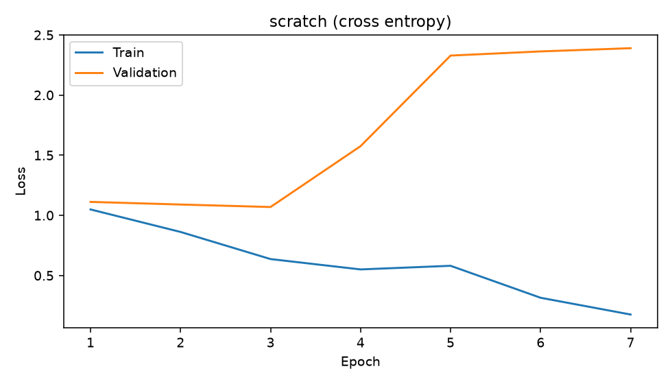
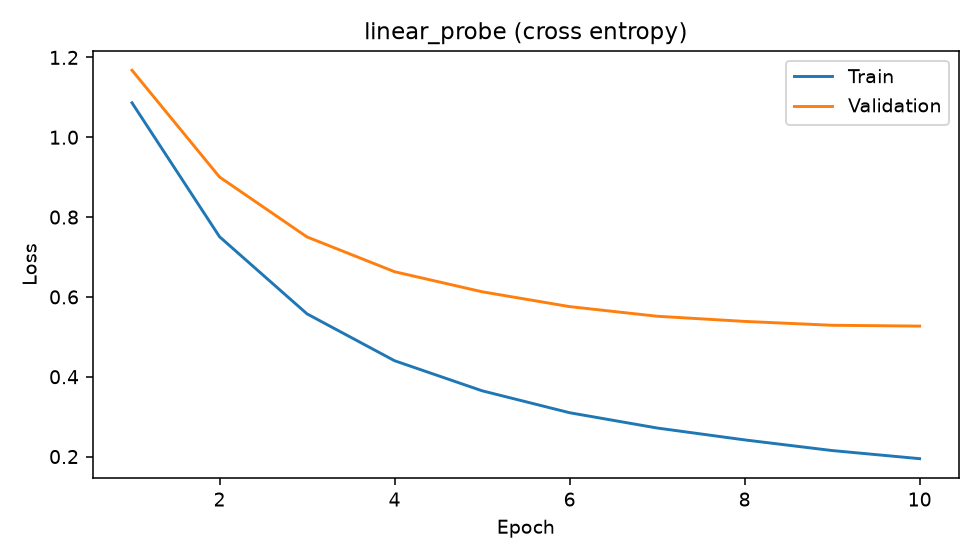
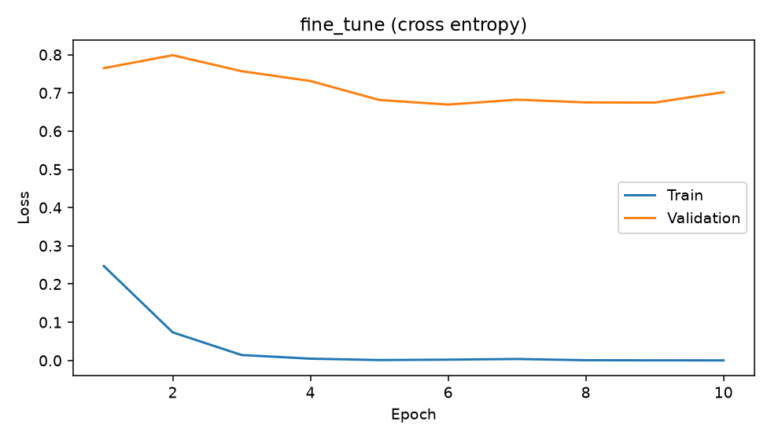
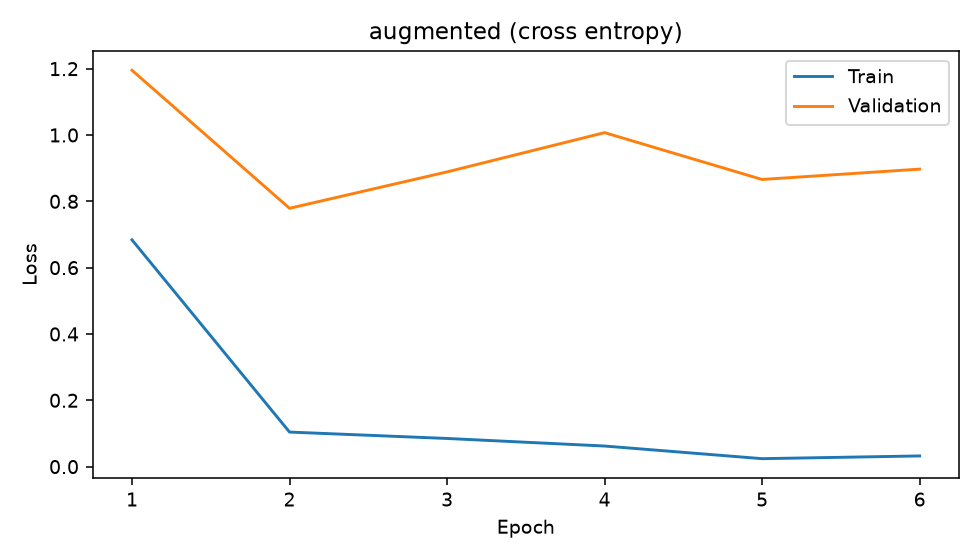
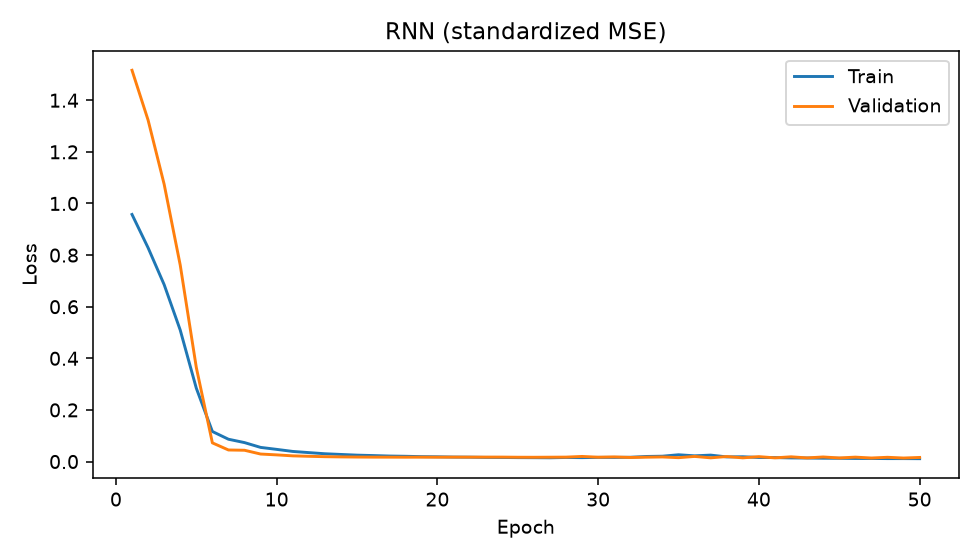
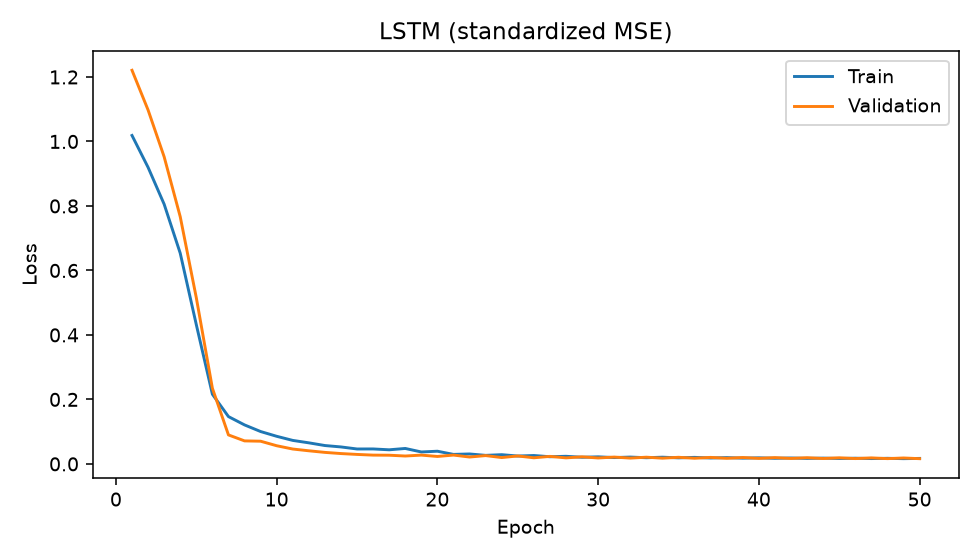
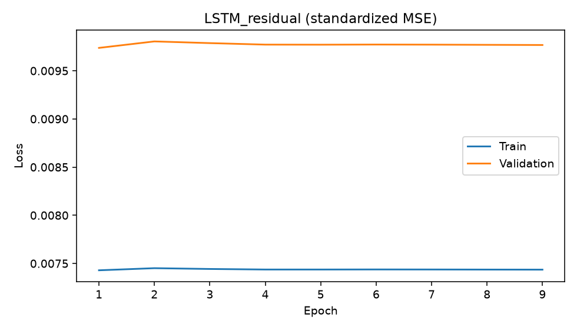
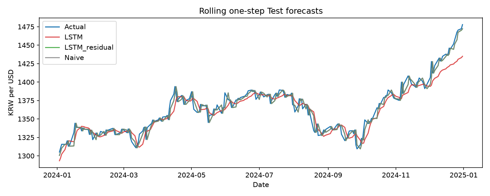
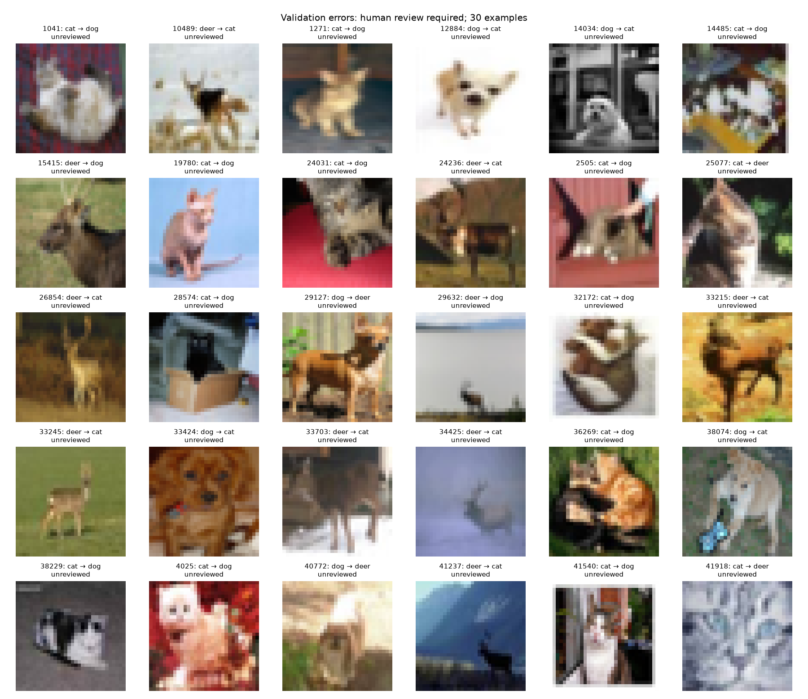

# 성능 진단 리포트

## 실험 및 상태

Seed 42, 이미지 클래스 cat, deer, dog. 클래스당 Train 40장, Validation 150장, Test 250장. 원본 이미지의 식별자와 SHA-256을 membership.csv에 기록하고 분할 간 동일 이미지 바이트 중복을 검사했다. 시계열은 DEXKOUS 1249개 관측이다. 두 트랙 모두 Validation loss로 checkpoint를 선택했다. 모든 비교군과 증강 설정은 실행 전에 고정했다.

사람 검수: **0/94건**. 최소 30건 직접 검수 요구의 충족 여부: **False**. 자동 제안은 실제 원인 또는 사람 검수로 간주하지 않는다. 본 보고서는 검수가 끝나기 전에는 최종 제출 완료본이 아니다.

## 이미지 실측 비교

| model | split | loss | accuracy |
| --- | --- | --- | --- |
| scratch | Train | 0.6364 | 0.8167 |
| scratch | Validation | 1.0692 | 0.4467 |
| scratch | Test | 1.0967 | 0.4213 |
| linear_probe | Train | 0.1947 | 0.9667 |
| linear_probe | Validation | 0.5269 | 0.7822 |
| linear_probe | Test | 0.5458 | 0.7680 |
| fine_tune | Train | 0.0021 | 1.0000 |
| fine_tune | Validation | 0.6695 | 0.7911 |
| fine_tune | Test | 0.6914 | 0.7533 |
| augmented | Train | 0.1042 | 0.9750 |
| augmented | Validation | 0.7790 | 0.7267 |
| augmented | Test | 0.7569 | 0.7147 |

Validation loss 기준 선택 전략: **linear_probe**. 동일 예산의 scratch 대비 Fine-tuning Test 정확도 차이: **33.20%p**. 증강 + weight decay 적용은 기본 Fine-tuning 대비 **-3.87%p**다. 증강 실험은 사전 지정한 민감도 실험이며 사람의 원인 태깅으로 검증한 인과적 개선이 아니다. 한 seed·적은 epoch의 결과이므로 최적의 freezing 전략으로 일반화할 수 없다. 사전학습의 외부 ImageNet 데이터와 추가 학습 비용도 비교 한계다.

## 학습 곡선과 편향·분산

| model | best_epoch | Train_loss | Validation_loss | gap | interpretation |
| --- | --- | --- | --- | --- | --- |
| scratch | 3 | 0.6364 | 1.0692 | 0.4328 | High Variance 또는 분포 이동 의심 |
| linear_probe | 10 | 0.1947 | 0.5269 | 0.3321 | High Variance 또는 분포 이동 의심 |
| fine_tune | 6 | 0.0021 | 0.6695 | 0.6674 | High Variance 또는 분포 이동 의심 |
| augmented | 2 | 0.1042 | 0.7790 | 0.6748 | High Variance 또는 분포 이동 의심 |
| RNN | 49 | 0.0114 | 0.0136 | 0.0022 | 큰 일반화 격차 없음; 절대 오차·베이스라인과 함께 편향 판단 |
| LSTM | 50 | 0.0170 | 0.0162 | -0.0008 | 큰 일반화 격차 없음; 절대 오차·베이스라인과 함께 편향 판단 |
| LSTM_residual | 1 | 0.0074 | 0.0097 | 0.0023 | 큰 일반화 격차 없음; 절대 오차·베이스라인과 함께 편향 판단 |

곡선은 증강 없는 Train 평가와 Validation 평가를 동일한 eval 모드에서 측정했다. 이미지 loss는 cross entropy, 시계열 loss는 Train 통계로 표준화한 값의 MSE다. Validation/Train > 1.5는 격차를 찾기 위한 휴리스틱일 뿐 확정 진단이 아니다. 무작위 3-class 분류의 cross entropy 기준은 ln(3) ≈ 1.099다. Train·Validation이 모두 이 수준이고 정확도도 1/3 근처면 높은 편향이나 학습 부족을 의심한다. Train만 낮고 Validation이 높으면 소표본 과적합을 의심하고 증강·weight decay·early stopping을 비교한다. 분포 이동도 같은 격차를 만들 수 있다.

## 시계열 실측과 개선

| model | MAE | RMSE | MAPE | MAPE_excluded |
| --- | --- | --- | --- | --- |
| Naive | 5.0737 | 6.8293 | 0.3720 | 0 |
| SMA5 | 7.4883 | 9.6573 | 0.5486 | 0 |
| SMA10 | 9.5579 | 12.3129 | 0.6990 | 0 |
| SMA20 | 13.7652 | 17.3965 | 1.0037 | 0 |
| EMA0.1 | 11.9989 | 15.1703 | 0.8746 | 0 |
| EMA0.3 | 6.9378 | 9.1102 | 0.5078 | 0 |
| EMA0.5 | 5.7385 | 7.6743 | 0.4206 | 0 |
| RNN | 7.9137 | 11.1535 | 0.5726 | 0 |
| LSTM | 8.0968 | 11.1204 | 0.5881 | 0 |
| LSTM_residual | 5.0918 | 6.8393 | 0.3733 | 0 |

기본 LSTM 대비 마지막 관측값에 변화량을 더하는 LSTM_residual의 MAE 개선률은 **37.11%**다. 잔차 모델은 Naive를 초기 예측으로 두고 변화량만 학습한다. 금융 시계열에 jittering/time-warping을 적용하지 않았다. Validation MAE 기준 베이스라인 선택은 **Naive**이며 Test로 파라미터를 고르지 않았다. [각 베이스라인 대비 개선률](baseline_comparison.md)의 음수도 그대로 보고한다. 딥러닝이 Naive보다 나쁘다면 복잡성 증가를 정당화할 수 없다.

## 데이터 특성 및 모델 구조

이미지는 클래스 균형을 맞췄으므로 이 실험의 클래스 불균형은 없다. 원본 32×32 영상을 128×128로 확대해도 새로운 세부 정보가 생기지 않는다. cat/deer/dog의 형태적 유사성과 배경 의존 가능성을 실제 오류 이미지와 클래스별 혼동 통계로 확인해야 한다. 낮은 해상도 자체가 모든 실패의 원인이라는 결론은 내리지 않는다.

시계열 Test 평균은 Train 평균보다 144.95 KRW/USD 차이가 난다. 표준화된 가격 수준을 직접 예측하는 신경망이 학습 범위 밖 수준으로 일반화하기 어려운지 확인할 근거다. Naive는 최근 수준을 즉시 반영하며 SMA는 변동을 완화하지만 급격한 변화에 늦게 반응한다. 지표는 환율 거래일 1-step rolling 평가이며 전체 Test를 한 번에 예측하는 장기 예측이 아니다.

CNN은 공간상의 국소 패턴을 공유 필터로 학습한다. RNN은 순서대로 hidden state를 갱신하므로 시계열에 적합하지만 긴 역전파에서 gradient 소실·폭주가 생길 수 있다. LSTM은 input/forget/output gate와 cell state를 추가해 장기 정보 유지 경로를 만든다. 이번 동일 30-step 실험의 RNN MAE는 7.9137, LSTM MAE는 8.0968다. 이 결과만으로 장기 기억의 우월성을 증명하지는 않는다. 장기 기억 효과를 분리하려면 더 긴 window 및 반복 seed 실험이 추가로 필요하다.

## 오류 진단 및 사람 검수

[오분류 갤러리](vision/error_gallery.html)와 [분석표](vision/error_review.csv)는 기본 Fine-tuning의 실제 Validation 오분류 전체를 포함한다. suggested_tag는 밝기·신뢰도 기반 가설이다. 검수자는 human_tag, reviewer, notes에 직접 관찰 근거를 적는다. 리뷰 집계 명령으로 최소 30개의 고유 사례와 태그별 건수를 확인한다. 미검수 건을 검수 통계 분모에 섞지 않는다.

낮은 Train 정확도와 클래스 전반의 혼동은 모델/학습 예산 문제를 먼저 점검한다. 낮은 Train loss와 특정 배경·조명에 집중한 Validation 오류는 데이터 다양성 문제를 점검한다. 라벨 오류 의심은 원본 대조 후 별도 기록하고 Test 라벨을 수정해 성능을 높이지 않는다. 사람 태그의 상위 실패 원인을 바탕으로 다음 개선을 선택하고 새로운 실험 디렉터리에 기록해야 사람 분석 → 개선의 사이클이 완성된다.

## 재현 및 누수 근거

[누수 방지·실행 정책](../../docs/protocol.md), 각 트랙 audit.json, predictions.csv, history.csv, 이미지 membership.csv 및 [베이스라인 비교](baseline_comparison.md)를 함께 확인한다. 학습 가중치와 원본 데이터는 로컬 data/ 및 결과 디렉터리에 남기되 Git에는 포함하지 않는다.
